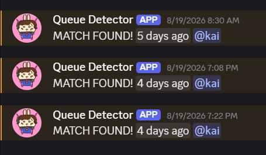

## Motivation

I need to maximize how much food I can eat between Overwatch matches without missing the start of the next one. So, I think this is a great situation for a tool because the problem is extremely specific, happens to me constantly, and is probably easier to automate than fix through self-control.

The goal is pretty simple: detect when I find a match and send a Discord notification to my phone so I know when I need to run back to my computer.

This lets me perfectly balance my gluttony and sloth. It's like my yin and yang.


## Research

Apparently, I am not the first person to have this problem.

There are a few Overwatch queue detectors floating around online, but most of the ones I found were either made for Overwatch 1, extremely outdated, or literally just don't work anymore.

The most common solution I saw was to read the screen and detect some visual change that only happens when a queue pops.

There aren't really many better alternatives anyway.

Originally, I thought maybe Overwatch 2 had some kind of API I could use to check whether I was in queue or whether a match had been found.

It doesn't.

Overwatch 2 is pretty lacking when it comes to a useful public API for this kind of live game information.

Another possible solution would be reading directly from the game's memory, but I don't really want to go anywhere near that. Even if it worked better, interacting directly with the game process feels like it could start looking suspicious to anti-cheat software, and getting banned because I wanted to make a sandwich would be a pretty embarrassing outcome.

So screen detection seemed like the obvious choice.

## Scope

I wanted this tool to do as little as possible.

The rules were basically:

- Don't hook into the Overwatch process.
- Don't read game memory.
- Don't read network packets or game files.
- Don't automate mouse or keyboard inputs.
- Just look at the screen.

So, no `pymem`, memory injection, automatic key presses, or anything else that directly interacts with the game.

The program is basically just staring at one pixel and waiting for it to turn green.

## Finding Something to Detect

Whenever you find a match in Overwatch, a green checkmark appears near the top of the screen.


That's perfect for what I need because the checkmark appears in the same place every time and has a pretty distinct green color.

So the plan became:

1. Find a pixel inside the green checkmark.
2. Read the RGB value of that pixel.
3. Keep checking it while I'm in queue.
4. If it turns green, assume I found a match.

I used [screencoordinates.com](https://screencoordinates.com/) to find the exact screen coordinates I wanted to check.

My first version was basically just:

```text
check pixel

if pixel == exact green color:
    match found
```

And it worked.

Mostly.

## Making It Slightly Less Bad

The problem with checking an exact RGB value is that the color wasn't actually exact every single time.

Depending on what was happening behind the UI, shadows and other stuff on screen could slightly change the color of the checkmark.

So maybe the green I was expecting was:

```text
(64, 200, 110)
```

but the pixel would actually come back as:

```text
(63, 200, 110)
```

One value was off by literally **1**, and my detector would decide that apparently this completely green pixel was not green.

Very cool.

At first I thought about checking a larger section of the screen, but that was honestly unnecessary. The same pixel was still reliable. I just needed to stop being so strict about what counted as green.

So I changed my color-checking function to allow a small range around the target RGB value.

Instead of:

```text
red == target_red
green == target_green
blue == target_blue
```

it became more like:

```text
target_red - 10 <= red <= target_red + 10
target_green - 10 <= green <= target_green + 10
target_blue - 10 <= blue <= target_blue + 10
```

So each RGB value can be about `±10` away from my target color and still count as a match.

Conceptually:

```text
read pixel

if pixel is close enough to green:
    match found
```

That's it.

It's still checking literally one pixel.

Just a slightly less stupid version of checking one pixel.

And this ended up working really well.

## Turning It Into a Detector

Once I had reliable match detection, I turned it into a function so I could keep calling it while the detector was running.

The basic logic is essentially:

```text
while detector is running:

    read pixel color

    if pixel is within green range:
        match found
    else:
        still waiting
```

There's also a small delay between checks because there is absolutely no reason for my computer to inspect this pixel several million times while I make a potato.

At this point, the program could consistently tell when I had found a match.

There was just one problem.

I built this entire thing because I wasn't going to be at my computer.

So having the script print `MATCH FOUND` into my terminal wasn't exactly useful.

## Discord Notifications

This is where Discord webhooks come in.


A Discord webhook lets me send a message to a Discord channel using a simple HTTP request.

So once the detector sees the green pixel, it sends a message through my webhook.

Something like:


Since I have Discord notifications on my phone, I now get notified wherever I am in the house.

The full system is basically:

```text
>queue for game

>go to kitchen

>pixel turns green

>program detects green

>Discord webhook sends message

>phone buzzes

>run back to computer
```

The future is incredible. MY future is incredible.

## Making a GUI

Originally, everything was just running through the terminal.

That was fine for testing, but I wanted the tool to actually feel like something I could open and use without touching the code every time.

So I made a small GUI with PyQt6.

The GUI lets me enter my Discord information and webhook, then start or stop the detector using buttons.

It also shows the current status, such as:

- Idle
- In Queue
- Match Found
- Error

Once everything is set up, I can just start it, minimize it, and go do something else.

Or, more realistically, go stare into my fridge.

## Does It Actually Work?

Yes.

Like, surprisingly well.

Once I added the RGB tolerance, I stopped getting the random misses I was seeing from tiny changes in the checkmark color.

Now I can queue for a game, walk away from my computer, and get a Discord notification on my phone almost immediately after the match is found.

It's a very stupid solution to a very stupid problem.

Which also makes it one of my favorite things I've built.


## Possible Improvements

There are still a few things I could improve.

### Detect Matches When Overwatch Isn't Focused

Right now, the detector relies on the actual Overwatch screen being visible because it's reading a pixel directly from the display.

It would be cool if it could somehow detect matches while Overwatch was minimized or covered by another window.

But this is also pretty niche.

If I'm sitting at my computer using another application, I can probably just hear the queue pop.

The entire reason I made this is because I'm somewhere else stealing food.

So I don't really care that much.

### Lock the Discord Fields

Right now, the Discord ID and webhook fields are editable whenever I'm using the program.

Because text fields automatically get focused pretty easily, it's possible to accidentally type into them or delete something.

I'd like to add a little lock button so once everything is configured, those fields become read-only until I unlock them again.

### Better Resolution Support

The detector currently looks at coordinates based on where the queue indicator appears on my screen.

It should work on other setups with some adjustment, but I haven't actually tested enough resolutions to confidently say that it does.

Eventually, it would be nice to automatically calculate the pixel location based on screen resolution instead of relying on a fixed coordinate.

## Final Thoughts

Other than that, it truly works like a charm.

Ironically, almost immediately after I finally got it working consistently, I stopped playing Overwatch nearly as much.

So I spent all this time making a solution to a problem and then stopped having the problem.

Maybe use it in my stead.

The project is on my GitHub, and the setup instructions are there too.

Now you can safely leave your queue and dedicate all of your mental energy to more important things.

Like finding something to blame your teammates for.